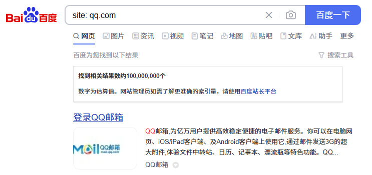
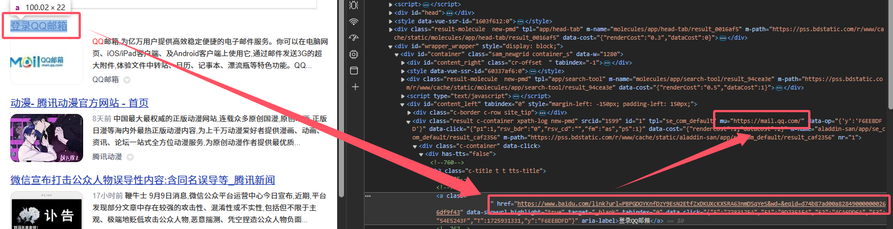
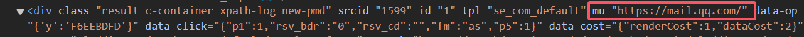
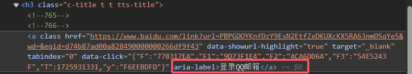
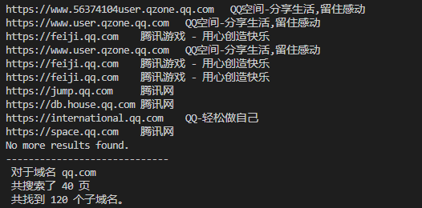
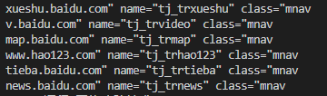
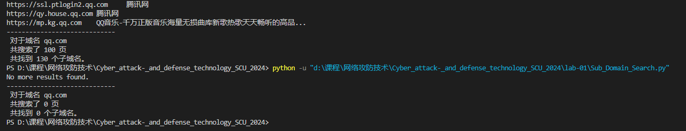

# 实验1：域名信息收集工具

## 实验内容：

本次实验主要考察大家的编程能力及子域名的信息收集方法，在文件夹“Lab1_code”提供了使用Bing搜索引擎的域名收集功能。请对该代码进行扩展，使其可支持百度搜索引擎的域名收集功能。需要实现如下功能：

1. 支持百度搜索引擎的域名提取，其中从百度搜索引擎提取的域名需为真实域名，而非百度的域名跳转链接；
2. 可扩充其他功能，比如域名所在的标题等信息。

## 实验步骤：

### 确定基本请求 URL

1. 使用 site: 命令在百度搜索引擎中搜索子域名，例如：site:qq.com


2. 在网址栏复制百度查找目标域名下的子域名的搜索语法

`https://www.baidu.com/s?ie=utf-8&f=8&rsv_bp=1&rsv_idx=1&tn=baidu&wd=site%3A%20qq.com&fenlei=256&rsv_pq=0x9dd71ab301a26022&rsv_t=6cb7DHPHPzTnauxun84nZ46229FixqYO3Oc3Tu669p09QcemcKu8zqjOdkhC&rqlang=en&rsv_dl=tb&rsv_enter=1&rsv_sug3=15&rsv_sug1=9&rsv_sug7=101&rsv_sug2=0&rsv_btype=t&prefixsug=site%253A%2520qq.com&rsp=6&inputT=3900&rsv_sug4=3900`

3. 使用获取的url，修改示例代码中的请求 url，使用变量`domain`表示我们的查找的目标域名，使其能够使用百度的搜索语法查找目标域名下的子域名。

```python
url = f"https://www.baidu.com/s?ie=utf-8&f=8&rsv_bp=1&tn=baidu&wd=site%3A{domain_request}"

```

### 分页控制与 URL 生成

4. 观察到百度搜索引擎的搜索结果会分页显示在百度搜索引擎中，，，我们需要在请求 URL 中添加分页参数。分页参数通常以`pn`表示，其值从 0 开始，每页显示 10 条结果。因此，我们可以通过循环生成不同的分页 URL 来获取所有搜索结果。

```python
# 循环生成不同的分页 URL
url = f"https://www.baidu.com/s?ie=utf-8&f=8&rsv_bp=1&tn=baidu&wd=site%3A{domain_request}&pn={page_num * 10}"

page_num = 0  # page_number 从 0 开始递增，每次增加 1

# 循环获取所有搜索结果
'''
while page_num < max_page_num:
    # 请求百度搜索引擎
    response = requests.get(url, headers=headers)
    # 解析搜索结果
    soup = BeautifulSoup(response.text, 'html.parser')
    # 获取搜索结果列表
    results = soup.find_all('div', class_='c-container')

    page_num += 1

'''
```

### 请求头设计

5. 修改请求头信息，使其能够伪装成浏览器访问百度搜索引擎。

```python
headers = {
    "User-Agent": "Mozilla/5.0 (Windows NT 10.0; Win64; x64) AppleWebKit/537.36 (KHTML, like Gecko) Chrome/58.0.3029.110 Safari/537.3"  
    # User-Agent 模拟了一个较为常见的 Chrome 浏览器版本。
    'Referer': 'https://www.baidu.com',  # 引用来源，模拟从其他页面跳转过来
}
```

### 处理跳转链接

> 百度的搜索结果链接可能是跳转链接，需要额外处理来获取真实的 URL：

6. 利用检查功能，查看搜索结果中的真实域名.


7. 我们可以看到，百度搜索引擎的搜索结果中，真实域名被百度搜索引擎的域名跳转链接所替代，真实的域名藏在 `class` 为 `'result'` 的 `<div>` 标签 后的 `'mu'`属性后。


8. 在提供的示例代码中添加过滤功能后，即可提取出真实域名。

```python
# 查找所有 class 为 'result' 的 <div> 标签，百度的搜索结果一般包含在这些标签中
job_bt = soup.find_all('div', attrs={'class': 'result'})
# 如果没有找到任何结果，结束循环
if not job_bt:
    print("No more results found.")

# 遍历查找到的每个 <div> 标签，提取子域名和描述
for i in job_bt:
    link = i.get('mu')  # 获取 class 为 'result' 的 <div> 标签的 'mu' 属性值，即子域名的链接
    if link:  # 如果链接存在，进一步解析子域名
    # 使用 urlparse 解析 URL，获取 URL 的协议 (scheme) 和网络位置 (netloc)
    domain = str(urlparse(link).scheme + "://" + urlparse(link).netloc)

    Subdomain.append(domain)  # 将新发现的域名加入子域名列表
    print(f"{domain}")  # 打印新发现的域名
```

### 随机延迟与异常处理

9.  为避免被目标网站封禁，我们需要在每次请求之间添加随机延迟。

```python
page_num += 1  # 页码加 1，准备抓取下一页
time.sleep(random.uniform(2, 5))  # 添加随机延时 2 到 5 秒，模拟人工操作
```

10. 为了处理可能出现的异常，如网络请求失败或解析错误，我们需要添加异常处理代码。

```python
while page_num < max_pages:
    # 构造请求的 URL，使用百度的搜索语法查找目标域名下的子域名
    url = f"https://www.baidu.com/s?ie=utf-8&f=8&rsv_bp=1&tn=baidu&wd=site%3A{domain_request}&pn={page_num * 10}"
    try:
        # 发送 HTTP GET 请求获取网页源码，设置超时时间为 10 秒
        resp = requests.get(url, headers=headers, timeout=10)
            
        # 检查请求状态码是否成功
        if resp.status_code != 200:
            print(f"Failed to retrieve page {page_num}, status code: {resp.status_code}")
            # 如果遇到请求过多的情况 (状态码 429)，随机休眠一段时间再继续
            if resp.status_code == 429:
                print("Too many requests, sleeping for a while...")
                time.sleep(random.randint(60, 120))  # 随机睡眠 1 到 2 分钟
                break  # 跳出循环，避免进一步请求
        
        '''获取子域名...'''

    except requests.RequestException as e:
        print(f"Request failed: {e}")
        # 判断是否是429（Too Many Requests）或其他错误状态码，增加等待时间
        if "429" in str(e) or "403" in str(e):
            print("Detected rate limiting or forbidden access, sleeping for longer...")
            time.sleep(random.randint(180, 300))  # 休眠 3 到 5 分钟再尝试
        else:
            time.sleep(random.randint(30, 60))  # 常规休眠 30 到 60 秒后重试
            continue
```

### 去重与存储

11.  在获取子域名后，我们需要对子域名进行去重处理，我们使用一个列表来存储已发现的子域名，并在每次发现新的子域名时检查它是否已经存在于列表中。如果不存在，则将其添加到列表中并打印出来。

```python
# 如果解析后的域名已经存在于 Subdomain 列表中则跳过，否则将域名添加到子域名列表中
    if domain not in Subdomain:
        Subdomain.append(domain)  # 将新发现的域名加入子域名列表
        print(f"{domain}")  # 打印新发现的域名
        found_domains += 1  # 新发现一个域名，计数加 1
```

### 获取子域名的描述

> 我们在看到域名时，可能无法立马知道这个域名的用途，所以我们可以获取该域名的描述信息。步骤类似于获取子域名。

12. 在刚才打开的检查窗口查看该域名的描述信息。



13.  在代码中添加获取描述信息的部分，可以看到 `title` 信息放在 `<h3>` 标签中。

```python
# 获取子域名的描述，提取 <h3> 标签内的文本
string = i.find('h3').get_text() if i.find('h3') else "No Title"  
```

### 完善反爬机制

14.  使用 `fake_useragent` 库生成随机的 User-Agent，模拟浏览器访问。

```python
from fake_useragent import UserAgent     # 用于生成随机的User-Agent，模拟浏览器访问
ua = UserAgent()  # 初始化 UserAgent 对象，用于随机生成 User-Agent 字符串

# 定义请求头，绕过反爬机制，模拟浏览器访问
    headers = {
        'User-Agent': ua.random,  # 使用随机的 User-Agent 模拟常见的浏览器请求
        'Accept': '*/*',  # 接受所有类型的响应
        'Referer': 'https://www.baidu.com',  # 引用来源，模拟从其他页面跳转过来
    }
```

## 完整代码

```python
import random
import time
import requests                          # 用于发送HTTP请求获取网页内容
from bs4 import BeautifulSoup            # 用于解析和处理获取的网页源码数据
from urllib.parse import urlparse        # 用于解析URL，提取协议、网络位置等信息
from fake_useragent import UserAgent     # 用于生成随机的User-Agent，模拟浏览器访问

# 定义一个函数，用于通过百度搜索子域名
def baidu_search(domain_request, max_pages=100):
    Subdomain = []  # 定义一个空列表，用于存储收集到的子域名
    ua = UserAgent()  # 初始化 UserAgent 对象，用于随机生成 User-Agent 字符串

    page_num = 0  # 已搜索的页数初始化为 0
    found_domains = 0  # 已找到的域名数量初始化为 0

    # 定义请求头，绕过反爬机制，模拟浏览器访问
    headers = {
        'User-Agent': ua.random,  # 使用随机的 User-Agent 模拟常见的浏览器请求
        'Accept': '*/*',  # 接受所有类型的响应
        'Referer': 'https://www.baidu.com',  # 引用来源，模拟从其他页面跳转过来
    }
    
    # 循环请求每一页的搜索结果，最多请求 max_pages 页
    while page_num < max_pages:
        # 构造请求的 URL，使用百度的搜索语法查找目标域名下的子域名
        url = f"https://www.baidu.com/s?ie=utf-8&f=8&rsv_bp=1&tn=baidu&wd=site%3A{domain_request}&pn={page_num * 10}"

        try:
            # 发送 HTTP GET 请求获取网页源码，设置超时时间为 10 秒
            resp = requests.get(url, headers=headers, timeout=10)
            
            # 检查请求状态码是否成功
            if resp.status_code != 200:
                print(f"Failed to retrieve page {page_num}, status code: {resp.status_code}")
                # 如果遇到请求过多的情况 (状态码 429)，随机休眠一段时间再继续
                if resp.status_code == 429:
                    print("Too many requests, sleeping for a while...")
                    time.sleep(random.randint(60, 120))  # 随机睡眠 1 到 2 分钟
                break  # 跳出循环，避免进一步请求

            # 使用 BeautifulSoup 解析获取到的网页源码，指定使用 'html.parser' 作为解析器
            soup = BeautifulSoup(resp.content, 'html.parser')

            # 查找所有 class 为 'result' 的 <div> 标签，百度的搜索结果一般包含在这些标签中
            job_bt = soup.find_all('div', attrs={'class': 'result'})

            # 如果没有找到任何结果，结束循环
            if not job_bt:
                print("No more results found.")
                break

            # 遍历查找到的每个 <div> 标签，提取子域名和描述
            for i in job_bt:
                link = i.get('mu')  # 获取 class 为 'result' 的 <div> 标签的 'mu' 属性值，即子域名的链接
                if link:  # 如果链接存在，进一步解析子域名
                    # 使用 urlparse 解析 URL，获取 URL 的协议 (scheme) 和网络位置 (netloc)
                    domain = str(urlparse(link).scheme + "://" + urlparse(link).netloc)
                    # 获取子域名的描述，提取 <h3> 标签内的文本
                    string = i.find('h3').get_text() if i.find('h3') else "No Title"  

                    # 如果解析后的域名已经存在于 Subdomain 列表中则跳过，否则将域名添加到子域名列表中
                    if domain not in Subdomain:
                        Subdomain.append(domain)  # 将新发现的域名加入子域名列表
                        print(f"{domain}\t{string}")  # 打印新发现的域名及其描述
                        found_domains += 1  # 新发现一个域名，计数加 1

            page_num += 1  # 页码加 1，准备抓取下一页
            time.sleep(random.uniform(2, 5))  # 添加随机延时 2 到 5 秒，模拟人工操作

        except requests.RequestException as e:
            print(f"Request failed: {e}")
            # 判断是否是429（Too Many Requests）或其他错误状态码，增加等待时间
            if "429" in str(e) or "403" in str(e):
                print("Detected rate limiting or forbidden access, sleeping for longer...")
                time.sleep(random.randint(180, 300))  # 休眠 3 到 5 分钟再尝试
            else:
                time.sleep(random.randint(30, 60))  # 常规休眠 30 到 60 秒后重试
            continue

    # 汇总打印搜索结果
    print("-----------------------------\n",
          f"对于域名 {domain_request} \n",
          f"共搜索了 {page_num} 页 \n",
          f"共找到 {found_domains} 个子域名。")

# 调用定义的函数，开始收集子域名
# 参数1：目标域名，参数2：要抓取的页数
baidu_search('qq.com', 100)

```

## 运行结果示例

> 此处的运行结果过长，截取部分作为展示



## 实验过程问题总结

1. 与 bing 不同，百度采用的是跳转链接，因此我们需要重新观察页面代码，找到真正的域名的链接，不能使用相同的方法进行爬取。若采用相同的方法，则只会出现下面的6个域名:



2. 在程序运行后，立即重新运行，会出现找不到子域名的情况，是因为频繁访问，被百度限制访问，即使我增设了延时功能，但仍不能解决该问题。考虑采用代理 ip 池来解决问题。



## 参考资料

[1] https://blog.csdn.net/qq_46145027/article/details/124133278
[2] https://blog.csdn.net/qq_53184526/article/details/126853601
[3] https://developers.google.cn/search/docs/monitor-debug/search-operators/all-search-site?hl=zh-cn
[4] https://blog.csdn.net/w1590191166/article/details/104160404